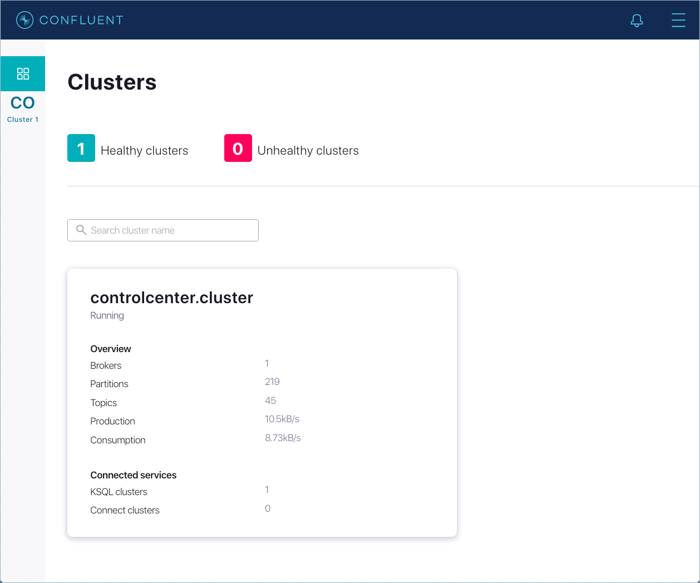
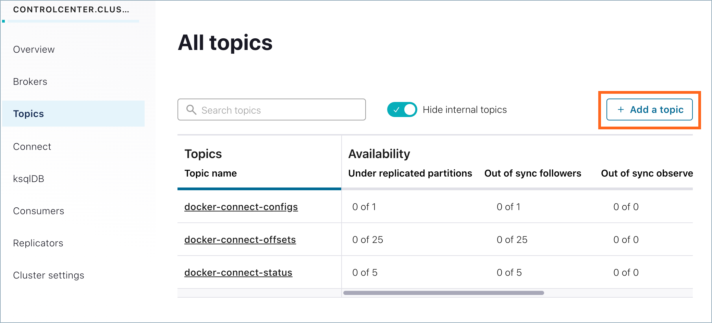
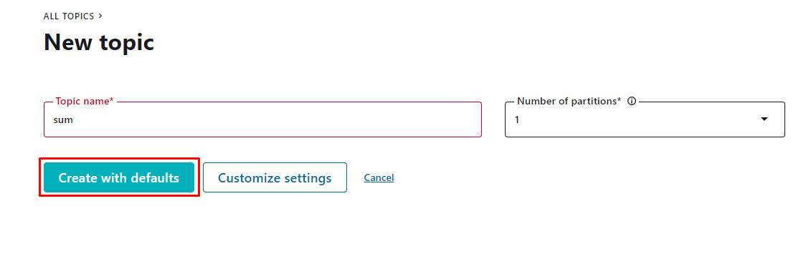
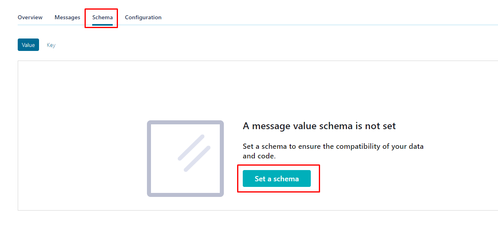
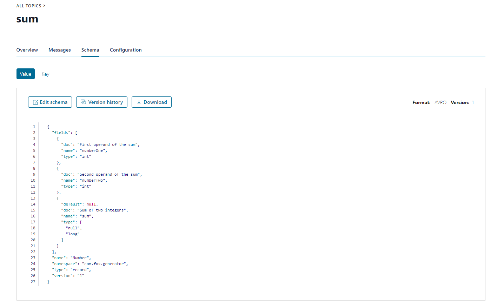
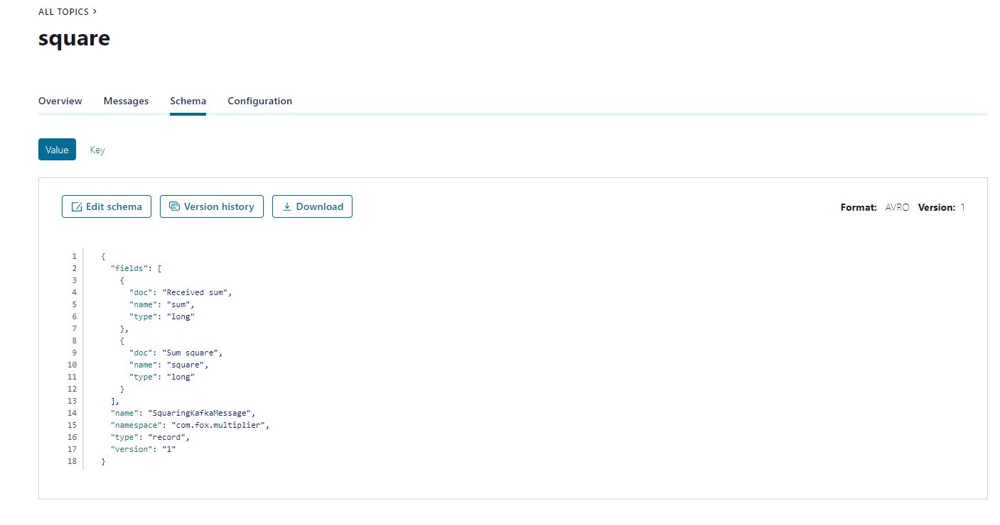
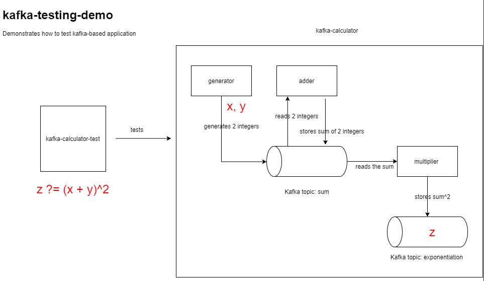

# kafka-testing-demo application

## Environment
To launch application on your PC you need to do following steps:
* clone Docker images from GitHub repository
```
git clone git@github.com:confluentinc/cp-all-in-one.git
```
* Navigate to the `cp-all-in-one-cloud` directory.
```
cd cp-all-in-one-cloud
```
* Checkout the 6.0.0-post branch.
```
git checkout 6.0.0-post
```
* To bring up all services locally, at once (make sure your Docker Desktop is running):
```
docker-compose up -d
```
* Optional: Run this command to verify that the services are up and running.
```
docker-compose ps
```
You should see the following:
```
     Name                    Command               State                Ports
------------------------------------------------------------------------------------------
broker            /etc/confluent/docker/run        Up      0.0.0.0:29092->29092/tcp,
                                                           0.0.0.0:9092->9092/tcp
connect           /etc/confluent/docker/run        Up      0.0.0.0:8083->8083/tcp,
                                                           9092/tcp
control-center    /etc/confluent/docker/run        Up      0.0.0.0:9021->9021/tcp
ksqldb-cli        ksql http://localhost:8088       Up
ksqldb-datagen    bash -c echo Waiting for K ...   Up
ksqldb-server     /etc/confluent/docker/run        Up      0.0.0.0:8088->8088/tcp
rest-proxy        /etc/confluent/docker/run        Up      0.0.0.0:8082->8082/tcp
schema-registry   /etc/confluent/docker/run        Up      0.0.0.0:8081->8081/tcp
zookeeper         /etc/confluent/docker/run        Up      0.0.0.0:2181->2181/tcp,
                                                           2888/tcp, 3888/tcp
```
If the state is not `Up`, rerun the `docker-compose up -d` command.

* Once all services are up wait 1-2 minutes and launch `http://localhost:9021/` in your browser. If all services are up and everything works properly, you'll see following:


* Select Topics from the cluster submenu and click Add a topic.


* Create a topic named `sum` and click Create with defaults.


* Go to `schema` => `Set a schema`


* Delete default schema and insert schema located in `multiplier/src/main/resources/avro/number.avsc`


* Create a topic `square` following above steps. The schema is located in `multiplier/src/main/resources/avro/square.avsc`


## Project diagram


## Application launch

Make sure your Docker Desktop is running and all docker images from `cp-all-in-one` are up and healthy.

1. Launch services `generator`, `adder`, `multiplier` using `mvn spring-boot:run` from command line.

2. To test whether everything works properly run functional tests: 
when all the services are running, run the `kafka-kalculator-test` using `mvn test` in command line.

3. Every time we send post request on `http://127.0.0.1:8090/generate` `generator` service generates two integers and send them to `sum` topic.
`adder` service consumes the message from the same topic, sum them and send the sum to the topic.
`multiplier` service consumes message with sum from `sum` topic, square it and send the result to `square` topic.
 